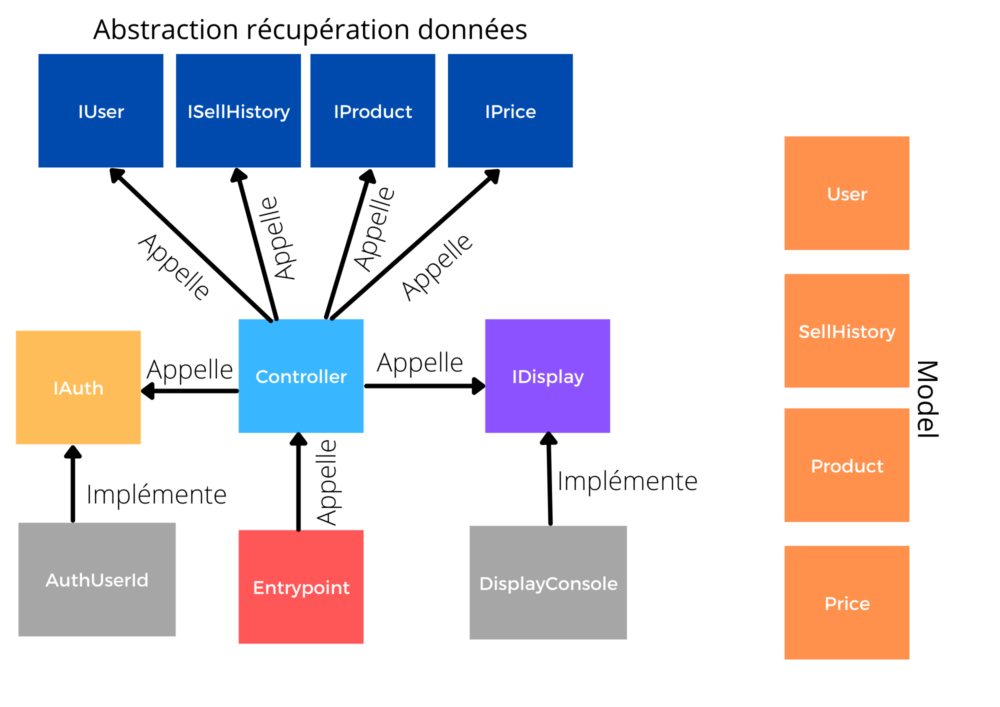

# Schema

# Description

Nous avons décidé d'utiliser des interfaces pour les différentes entités dont nous avons besoin. Un controller unique en dépend afin de pouvoir récupérer toutes les données nécessaires à l'affichage. Ce dernier hérite aussi d'une interface, afin de permettre une implémentation différente selons les besoins. Tout ce qui concerne l'affichage est situé dans le dossier "display".
Nous avons placé l'interface lié à l'authentification et son implémentation dans un dossier "auth", tous les modèles utilisé pour manipuler les données sont dans un dossier "model".
Un fichier entrypoint.py sert d'entrée au programme et est situé à la racine de l'application.
Nous avons choisi d'utiliser des variables d'environnements pour par exemple les modificateur de prix afin qu'ils puissent être modifiés facilement par la suite, à partir d'un back office par exemple.